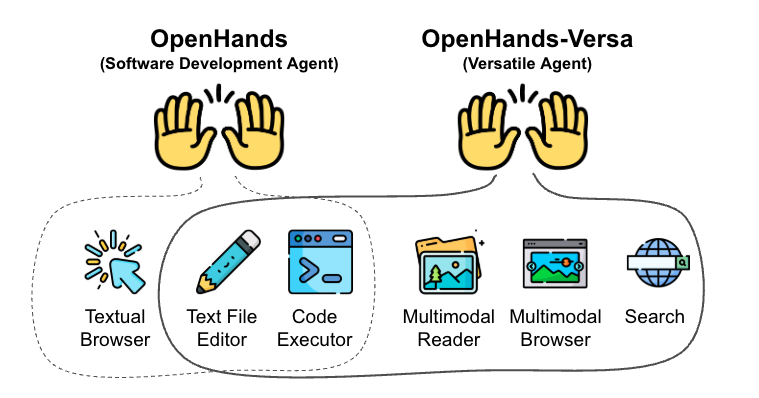

<a name="readme-top"></a>


<div align="center">
  <h1 align="center">OpenHands-Versa: Coding Agents with Multimodal Browsing are Generalist Problem Solvers</h1>
  
</div>
<!-- <div align="center">
  <a href="https://arxiv.org/abs/2506.03011"></a>
  <a href="https://github.com/adityasoni9998/OpenHands-Versa/blob/main/LICENSE"></a>
  <hr>
</div> -->

This repository is a reference implementation of the paper [**Coding Agents with Multimodal Browsing are Generalist Problem Solvers**](https://arxiv.org/abs/2506.03011) containing scripts for reproducing the experiments in the paper.

## Overview
Modern human labor is characterized by specialization; we train for years and develop particular tools that allow us to perform well across a variety of tasks. In addition, AI agents have been specialized for domains such as software engineering, web navigation, and workflow automation.
However, this results in agents that are good for one thing but fail to generalize beyond their intended scope. One reason for this is that agent developers provide a highly specialized set of tools or make architectural decisions optimized for a specific use case or benchmark.
In this work, we ask the question: what is the minimal set of general tools that can be used to achieve high performance across a diverse set of tasks? Our answer is OpenHands-Versa, a generalist agent built with a modest number of general tools: code editing and execution, web search, as well as multimodal web browsing and file access. Importantly, OpenHands-Versa demonstrates superior or competitive performance over leading specialized agents across three diverse and challenging benchmarks: SWE-Bench Multimodal, GAIA, and The Agent Company, outperforming the best-performing previously published results with absolute improvements in success rate of 9.1, 1.3, and 9.1 points respectively. Further, we show how existing state-of-the-art multi-agent systems fail to generalize beyond their target domains. These results demonstrate the feasibility of developing a generalist agent to solve diverse tasks and establish OpenHands-Versa as a strong baseline for future research.


## Installation
OpenHands-Versa is built on top the OpenHands - a popular framework for open-source AI Agents. Thus, the installation instructions are same as that of OpenHands. We require ``sudo`` access to the machine since experiments on [The Agent Company](https://github.com/TheAgentCompany/TheAgentCompany) need root privileges. All our experiments are run using Ubuntu OS (>=22.04) and we provide installation instructions for the same below:

### 1. Pre-requisites:
* [Docker](https://docs.docker.com/engine/install/ubuntu/)
* [Conda](https://www.anaconda.com/docs/getting-started/miniconda/install#linux)
* OS-specific dependencies:
  - Ubuntu: build-essential => `sudo apt-get install build-essential`

Make sure you have all these dependencies installed before moving on to next steps. 

### 2. Build and Setup The Environment
We recommend creation of a conda environment for installing dependencies as shown below:

```bash
# Install Python=3.12, nodejs>=22.x, and poetry
conda create -n oh_versa python=3.12
conda install -c conda-forge "nodejs>=22"
conda install conda-forge::poetry
```

From the root directory of the project, run the below command to ensure OpenHands-Versa is ready to run on your system:
```bash
make build
```

### 3. Configuring the Language Model
OpenHands-Versa supports a diverse array of Language Models (LMs) through the powerful [litellm](https://docs.litellm.ai) library. We use `claude-3-7-sonnet-20250219` and `claude-sonnet-4-20250514` for our experiments You can configure your LLMs by creating a config.toml file in the project root directory similar to [config_example.toml](./config_example.toml).

For details regarding support for other operating systems, support for other LLMs and debugging tips please refer to [Development.md](./Development.md).

## Reproducing Results
We benchmark OpenHands-Versa on three diverse and challenging agent benchmarks: [GAIA](https://huggingface.co/datasets/gaia-benchmark/GAIA), [The Agent Company](https://the-agent-company.com/), and [SWE-Bench Multimodal](https://www.swebench.com/multimodal.html). For instructions about reproducing our results, please refer to the respective README.md files for [GAIA](./evaluation/benchmarks/gaia/README.md), [The Agent Company](./evaluation/benchmarks/the_agent_company/README.md) and [SWE-Bench Multimodal](./evaluation/benchmarks/swe_bench/README.md). Note that we use [Tavily](https://www.tavily.com/) API for our search tool and running the experiments requires a search API key.

## Note
The methodology in OpenHands-Versa has also been implemented in upstream [OpenHands](https://github.com/All-Hands-AI/OpenHands), and we recommend using the upstream repository if you want to use OpenHands Versa in your own work.

## 📜 License

Distributed under the MIT License. See [`LICENSE`](./LICENSE) for more information.

## 📚 Cite
```
@misc{soni2025codingagentsmultimodalbrowsing,
      title={Coding Agents with Multimodal Browsing are Generalist Problem Solvers}, 
      author={Aditya Bharat Soni and Boxuan Li and Xingyao Wang and Valerie Chen and Graham Neubig},
      year={2025},
      eprint={2506.03011},
      archivePrefix={arXiv},
      primaryClass={cs.CL},
      url={https://arxiv.org/abs/2506.03011}, 
}
```