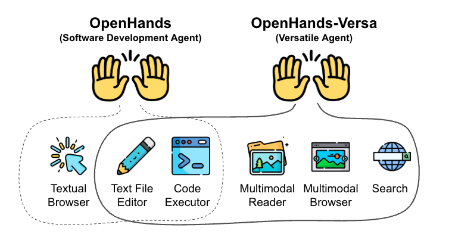

<a name="readme-top"></a>


<div align="center">
  <h1 align="center">OpenHands-Versa: Coding Agents with Multimodal Browsing are General-Purpose Problem Solvers</h1>
  
</div>

This repository is a reference implementation of the paper **Coding Agents with Multimodal Browsing are General-Purpose Problem Solvers** containing scripts for reproducing the experiments in the paper.

## Overview
Modern human labor is characterized by specialization; we train for years and develop particular tools that allow us to perform well across a variety of tasks. Similarly, specialized AI agents with task-specific tools or architectures often fail to generalize beyond their intended scope. In this work, we ask: *what is the minimal set of general tools for achieving generalizability across diverse domains?* We propose OpenHands-Versa, a single-agent system with a modest number of general tools like code execution, search engine, web browser and multimodal file viewer, for three practical domains: software engineering, deep research, and web browsing. Notably, OpenHands-Versa demonstrates superior or competitive performance over task-specific specialized agents on three challenging benchmarks: SWE-Bench Multimodal, GAIA, and The Agent Company, with absolute improvements in success rate of **9.1**, **1.3**, and **9.1** points, respectively. 
Thus, our minimal *single-agent* system can achieve strong generalization indicating that specialist agents provide no practical benefit. Furthermore, we find that specialist multi-agent systems do not generalize beyond their intended scope. These findings establish OpenHands-Versa as a strong baseline for future research.

## Installation and LLM Configuration
OpenHands-Versa is built on top the OpenHands - a popular framework for open-source AI Agents and the installation instructions are similar as that of OpenHands. We require ``sudo`` access to the machine since experiments on [The Agent Company](https://github.com/TheAgentCompany/TheAgentCompany) need root privileges. All our experiments are run using Ubuntu OS (>=22.04) and we provide installation instructions for the same below:

### 1. Pre-requisites:
* [Docker](https://docs.docker.com/engine/install/ubuntu/)
* [Conda](https://www.anaconda.com/docs/getting-started/miniconda/install#linux)
* OS-specific dependencies:
  - Ubuntu: build-essential => `sudo apt-get install build-essential`

Make sure you have all these dependencies installed before moving on to next steps.

### 2. Build and Setup The Environment
We recommend creation of a conda environment for installing dependencies as shown below:

```bash
# Install Python=3.12, nodejs>=22.x, and poetry
conda create -n oh_versa python=3.12
conda activate oh_versa
conda install -c conda-forge "nodejs>=22"
conda install conda-forge::poetry
```

From the root directory of the project, run the below command to ensure OpenHands-Versa is ready to run on your system:
```bash
make build
```

### 3. Configuring the Language Model
OpenHands-Versa supports a diverse array of Language Models (LMs) through the powerful [litellm](https://docs.litellm.ai) library. We use `claude-3-7-sonnet-20250219` and `claude-sonnet-4-20250514` for our experiments. You can configure the LLMs by creating a config.toml file in the project root directory similar to [config_example.toml](./config_example.toml).

For details regarding support for other operating systems, support for other LLMs and debugging tips please refer to [Development.md](./Development.md).

## Reproducing Results
We benchmark OpenHands-Versa on three popular and challenging agent benchmarks: [GAIA](https://huggingface.co/datasets/gaia-benchmark/GAIA), [The Agent Company](https://the-agent-company.com/), and [SWE-Bench Multimodal](https://www.swebench.com/multimodal.html). For instructions about reproducing our results, please refer to the respective README.md files for [GAIA](./evaluation/benchmarks/gaia/README.md), [The Agent Company](./evaluation/benchmarks/the_agent_company/README.md) and [SWE-Bench Multimodal](./evaluation/benchmarks/swe_bench/README.md). Note that we use [Tavily](https://www.tavily.com/) API for our search tool and running the experiments requires a search API key.

## 📜 License

Distributed under the MIT License. See [`LICENSE`](./LICENSE) for more information.

